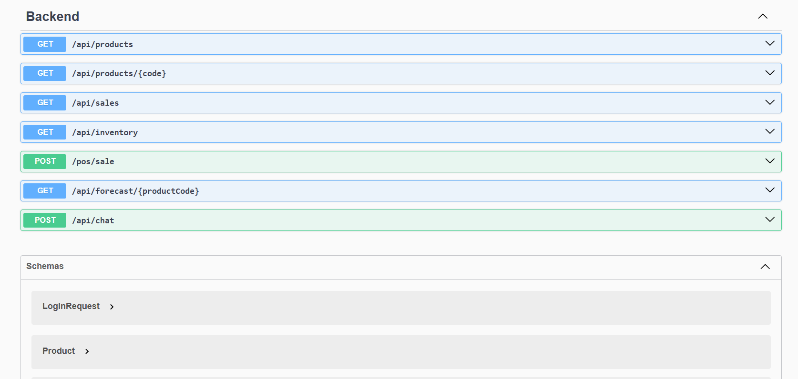
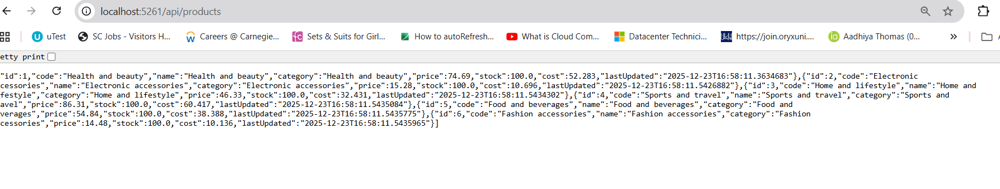
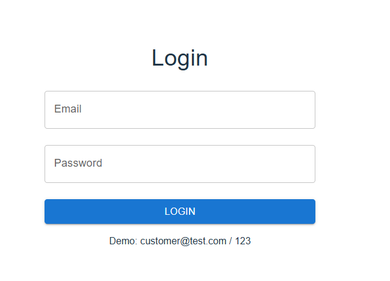

# Supermarket ERP Demo (React + .NET 8 + JWT)

A full‑stack supermarket web app showing a realistic **POS + inventory** scenario, built with:

- Backend: ASP.NET Core 8 minimal APIs, JWT authentication, EF Core, CSV‑based seeding
- Frontend: React 18 + Vite, Material UI, React Query, global Cart and Auth contexts

---

## Features

- Product catalog loaded dynamically from `/api/products`
- Global shopping cart with add/update/remove and total calculation
- JWT‑based login and protected routes (cart and POS endpoints)
- Seeded demo data from a supermarket sales CSV file
- Clean separation of backend (API) and frontend (React SPA)

---

## Screenshots

> Home page (entry point to shopping and cart)

> Products page with category filter, search, and **Add to Cart** actions

> Swagger UI for backend APIs (products, sales, inventory, POS sale, forecast, chat)

> Auth section in Swagger showing `/api/Auth/login` example

> Raw JSON response from `/api/products`

> Login screen used by the React frontend

> Cart page with quantities, line totals, and overall total

---

## Sample User Flow

1. **Start backend**
   
cd Backend
dotnet run
API runs on http://localhost:5261

- Product data is loaded from `supermarket-sales.csv` into the database on first run.
- A demo user like `customer@test.com` is seeded for login.

2. **Start frontend**

cd Frontend
npm install
npm run dev

App runs on http://localhost:5173

3. **Browse products**

- Open `http://localhost:5173/products`.
- Use the **category filter** and **search box** to explore items.
- Click **ADD TO CART** on several products; the cart state is stored globally and persisted via `localStorage`.

4. **Log in**

- Navigate to `http://localhost:5173/login`.
- Enter the demo credentials shown on the screen (for example `customer@test.com / 123`).
- The frontend calls `/api/Auth/login`, receives a **JWT access token**, stores it in memory and `localStorage`, and all subsequent API requests automatically include `Authorization: Bearer <token>`.

5. **View and manage the cart**

- Go to `http://localhost:5173/cart` (or use the **View Cart** button).
- See all items added from the products page with:
  - Product name and unit price
  - Quantity controls (**+ / −**)
  - Per‑line totals and a grand total
- Remove items with the trash icon or adjust quantities; totals update instantly.

6. **Backend API inspection**

- Open Swagger at `http://localhost:5261/swagger`.
- Test endpoints such as:
  - `GET /api/products` – product catalog
  - `GET /api/inventory` – basic inventory and low‑stock info
  - `POST /pos/sale` – sample POS sale endpoint (protected by JWT)
  - `POST /api/chat` – simple demo assistant for inventory/sales queries

This flow demonstrates how the React frontend, JWT‑protected .NET API, and shared cart/auth state work together to simulate a small supermarket ERP.
